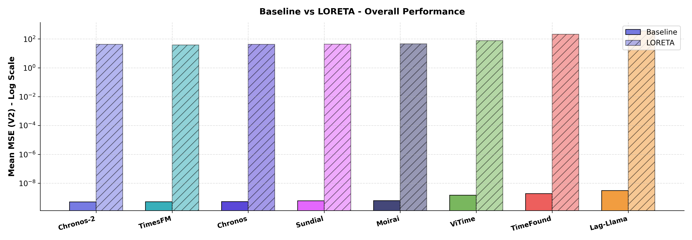
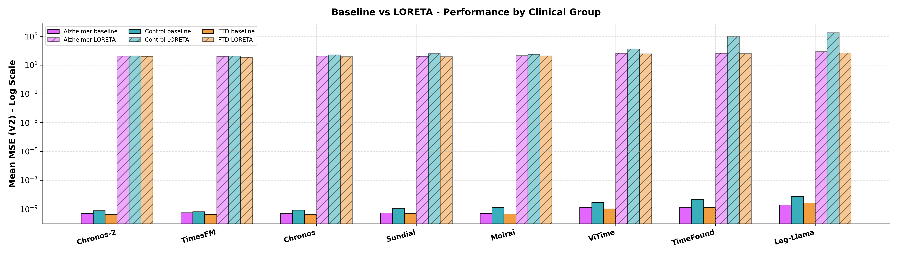

# TSFM Benchmark - Baseline vs LORETA Comparison

## Parameters
- **Baseline**: scalp EEG (Fp1, Fp2, P3, P4)
- **LORETA**: sLORETA source parcels, 6 cortical regions x 2 hemispheres (fsaverage)
- **Metric**: `mse_phys` (Mean MSE (V2))

---

## Table 1 - Overall Comparison

| Model     |   Baseline Mean MSE (V2) |   LORETA Mean MSE (V2) | Delta% (LORETA vs Baseline)   |
|:----------|-------------------------:|-----------------------:|:------------------------------|
| Chronos   |               5.2126e-10 |                 41.99  | +8055436221220.4%             |
| Chronos-2 |               5.0015e-10 |                 42.12  | +8421377841600.3%             |
| Lag-Llama |               3.1114e-09 |                361.85  | +11630019752832.3%            |
| Moirai    |               6.1395e-10 |                 45.353 | +7387007197355.5%             |
| Sundial   |               6.0375e-10 |                 43.65  | +7229834735321.9%             |
| TimeFound |               1.892e-09  |                211.48  | +11177954500092.6%            |
| TimesFM   |               5.1745e-10 |                 38.626 | +7464692221203.1%             |
| ViTime    |               1.471e-09  |                 75.786 | +5152141329254.4%             |

> Positive Delta% = LORETA worse (higher MSE); negative = LORETA better.

---

## Table 2 - Performance by Clinical Group

