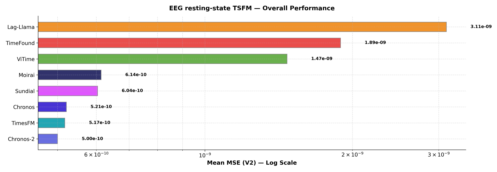
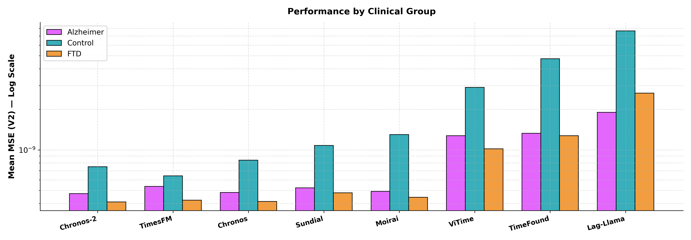
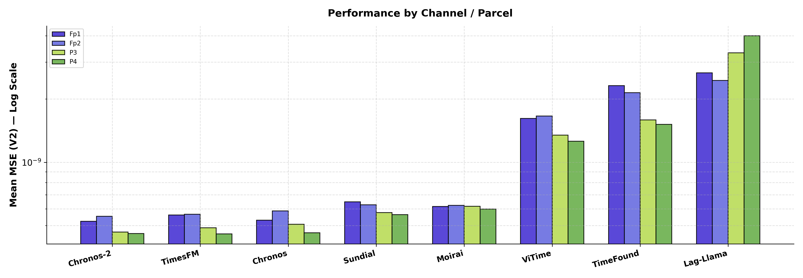

# TSFM Benchmark - Baseline Pipeline Results

## Parameters
- **Dataset**: ds004504 (Alzheimer resting-state EEG)
- **Pipeline**: Scalp EEG — Fp1, Fp2, P3, P4
- **Context**: 512 samples  |  **Horizon**: 64 samples
- **Metric**: `mse_phys` (Mean MSE (V2))

---

## Table 1 - Overall Performance

| Model     |   Mean MSE (V2) |
|:----------|----------------:|
| Chronos-2 |      5.0015e-10 |
| TimesFM   |      5.1745e-10 |
| Chronos   |      5.2126e-10 |
| Sundial   |      6.0375e-10 |
| Moirai    |      6.1395e-10 |
| ViTime    |      1.471e-09  |
| TimeFound |      1.892e-09  |
| Lag-Llama |      3.1114e-09 |

---

## Table 2 - Performance by Clinical Group

| Model     |   Alzheimer |    Control |        FTD |    Average |
|:----------|------------:|-----------:|-----------:|-----------:|
| Chronos   |  4.8297e-10 | 8.3986e-10 | 4.1404e-10 | 5.2126e-10 |
| Chronos-2 |  4.7336e-10 | 7.5038e-10 | 4.1075e-10 | 5.0015e-10 |
| TimesFM   |  5.3604e-10 | 6.411e-10  | 4.2302e-10 | 5.1745e-10 |
| Moirai    |  4.9239e-10 | 1.2996e-09 | 4.4503e-10 | 6.1395e-10 |
| Lag-Llama |  1.8991e-09 | 7.6512e-09 | 2.6362e-09 | 3.1114e-09 |
| Sundial   |  5.2326e-10 | 1.0797e-09 | 4.8035e-10 | 6.0375e-10 |
| ViTime    |  1.276e-09  | 2.9148e-09 | 1.019e-09  | 1.471e-09  |
| TimeFound |  1.3294e-09 | 4.7521e-09 | 1.2749e-09 | 1.892e-09  |

---

## Table 3 - Performance by Electrode

| Model     |        Fp1 |        Fp2 |         P3 |         P4 |    Average |
|:----------|-----------:|-----------:|-----------:|-----------:|-----------:|
| Chronos   | 5.297e-10  | 5.8712e-10 | 5.0648e-10 | 4.6174e-10 | 5.2126e-10 |
| Chronos-2 | 5.238e-10  | 5.5324e-10 | 4.6547e-10 | 4.5809e-10 | 5.0015e-10 |
| TimesFM   | 5.6047e-10 | 5.6603e-10 | 4.8739e-10 | 4.5592e-10 | 5.1745e-10 |
| Moirai    | 6.1561e-10 | 6.2323e-10 | 6.1777e-10 | 5.992e-10  | 6.1395e-10 |
| Lag-Llama | 2.6658e-09 | 2.4551e-09 | 3.3215e-09 | 4.003e-09  | 3.1114e-09 |
| Sundial   | 6.4854e-10 | 6.2795e-10 | 5.7573e-10 | 5.6279e-10 | 6.0375e-10 |
| ViTime    | 1.6168e-09 | 1.6595e-09 | 1.3469e-09 | 1.2607e-09 | 1.471e-09  |
| TimeFound | 2.3162e-09 | 2.1467e-09 | 1.5902e-09 | 1.5147e-09 | 1.892e-09  |

