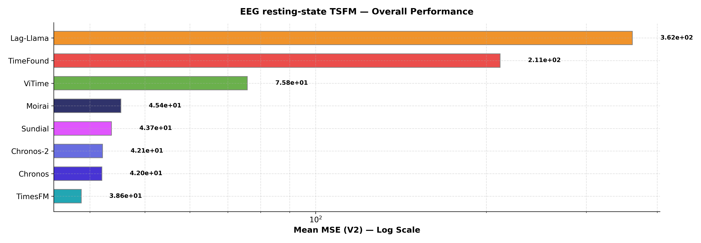
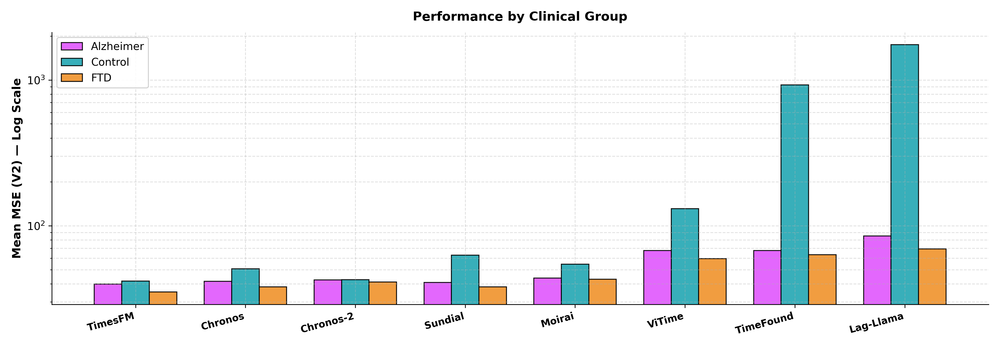
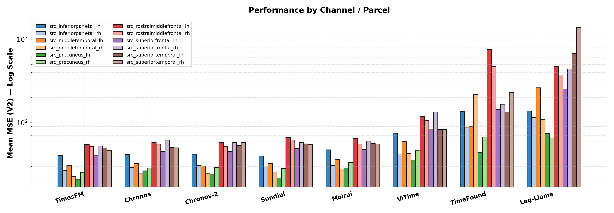

# TSFM Benchmark - Loreta Pipeline Results

## Parameters
- **Dataset**: ds004504 (Alzheimer resting-state EEG)
- **Pipeline**: sLORETA source parcels — 6 cortical regions x 2 hemispheres (fsaverage)
- **Context**: 512 samples  |  **Horizon**: 64 samples
- **Metric**: `mse_phys` (Mean MSE (V2))

---

## Table 1 - Overall Performance

| Model     |   Mean MSE (V2) |
|:----------|----------------:|
| TimesFM   |          38.626 |
| Chronos   |          41.99  |
| Chronos-2 |          42.12  |
| Sundial   |          43.65  |
| Moirai    |          45.353 |
| ViTime    |          75.786 |
| TimeFound |         211.48  |
| Lag-Llama |         361.85  |

---

## Table 2 - Performance by Clinical Group

| Model     |   Alzheimer |   Control |    FTD |   Average |
|:----------|------------:|----------:|-------:|----------:|
| Chronos   |      41.562 |    50.748 | 38.057 |    41.99  |
| Chronos-2 |      42.528 |    42.674 | 41.182 |    42.12  |
| TimesFM   |      39.793 |    41.747 | 35.141 |    38.626 |
| Moirai    |      43.842 |    54.538 | 42.904 |    45.353 |
| Lag-Llama |      85.059 |  1748.1   | 69.275 |   361.85  |
| Sundial   |      40.778 |    62.916 | 38.046 |    43.65  |
| ViTime    |      67.583 |   131.15  | 59.602 |    75.786 |
| TimeFound |      67.512 |   924.75  | 63.401 |   211.48  |

---

## Table 3 - Performance by Source Parcel

| Model     |   src_inferiorparietal_lh |   src_inferiorparietal_rh |   src_middletemporal_lh |   src_middletemporal_rh |   src_precuneus_lh |   src_precuneus_rh |   src_rostralmiddlefrontal_lh |   src_rostralmiddlefrontal_rh |   src_superiorfrontal_lh |   src_superiorfrontal_rh |   src_superiortemporal_lh |   src_superiortemporal_rh |   Average |
|:----------|--------------------------:|--------------------------:|------------------------:|------------------------:|-------------------:|-------------------:|------------------------------:|------------------------------:|-------------------------:|-------------------------:|--------------------------:|--------------------------:|----------:|
| Chronos   |                    41.768 |                    29.185 |                  32.579 |                  24.479 |             26.512 |             28.676 |                        57.961 |                        55.436 |                   45.165 |                   61.778 |                    50.344 |                    49.996 |    41.99  |
| Chronos-2 |                    41.998 |                    30.96  |                  30.485 |                  24.813 |             24.285 |             28.895 |                        57.779 |                        51.532 |                   45.202 |                   57.942 |                    53.474 |                    58.072 |    42.12  |
| TimesFM   |                    40.543 |                    26.716 |                  30.672 |                  22.795 |             21.059 |             25.533 |                        55.143 |                        51.602 |                   40.759 |                   52.668 |                    49.745 |                    46.279 |    38.626 |
| Moirai    |                    47.301 |                    30.753 |                  36.082 |                  27.952 |             28.6   |             33.515 |                        64.603 |                        55.581 |                   47.714 |                   60.172 |                    56.414 |                    55.546 |    45.353 |
| Lag-Llama |                   137.89  |                   116.13  |                 261.92  |                 109.01  |             74.484 |             65.727 |                       471.08  |                       363.56  |                  252.78  |                  439.56  |                   669.16  |                  1381     |   361.85  |
| Sundial   |                    40.084 |                    29.621 |                  32.543 |                  25.591 |             21.787 |             28.336 |                        66.839 |                        62.028 |                   48.909 |                   57.737 |                    55.785 |                    54.545 |    43.65  |
| ViTime    |                    74.845 |                    42.35  |                  59.423 |                  42.551 |             35.815 |             46.823 |                       118.15  |                       106.87  |                   82.22  |                  133.99  |                    83.341 |                    83.058 |    75.786 |
| TimeFound |                   135.73  |                    86.936 |                  89.999 |                 218.59  |             43.722 |             67.412 |                       751.95  |                       470.38  |                  143.57  |                  166     |                   133.98  |                   229.53  |   211.48  |

