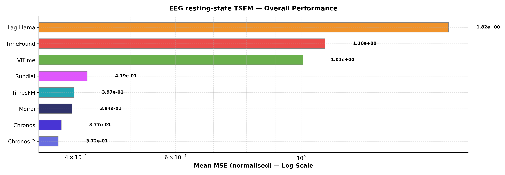
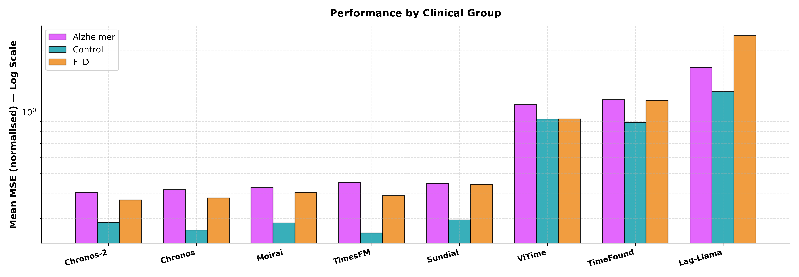
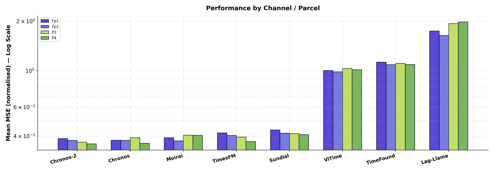

# TSFM Benchmark - Baseline Pipeline Results

## Parameters
- **Dataset**: ds004504 (Alzheimer resting-state EEG)
- **Pipeline**: Scalp EEG — Fp1, Fp2, P3, P4
- **Context**: 512 samples  |  **Horizon**: 64 samples
- **Metric**: `mse_norm` (Mean MSE (normalised))

---

## Table 1 - Overall Performance

| Model     |   Mean MSE (normalised) |
|:----------|------------------------:|
| Chronos-2 |                 0.37226 |
| Chronos   |                 0.37689 |
| Moirai    |                 0.39375 |
| TimesFM   |                 0.39704 |
| Sundial   |                 0.41883 |
| ViTime    |                 1.0078  |
| TimeFound |                 1.1027  |
| Lag-Llama |                 1.8224  |

---

## Table 2 - Performance by Clinical Group

| Model     |   Alzheimer |   Control |     FTD |   Average |
|:----------|------------:|----------:|--------:|----------:|
| Chronos   |     0.41422 |   0.26275 | 0.37803 |   0.37689 |
| Chronos-2 |     0.40239 |   0.28684 | 0.36965 |   0.37226 |
| TimesFM   |     0.4507  |   0.25404 | 0.38758 |   0.39704 |
| Moirai    |     0.42401 |   0.28492 | 0.40326 |   0.39375 |
| Lag-Llama |     1.6613  |   1.26    | 2.3727  |   1.8224  |
| Sundial   |     0.44678 |   0.29443 | 0.44015 |   0.41883 |
| ViTime    |     1.089   |   0.92303 | 0.92408 |   1.0078  |
| TimeFound |     1.1492  |   0.88864 | 1.1418  |   1.1027  |

---

## Table 3 - Performance by Electrode

| Model     |     Fp1 |     Fp2 |      P3 |      P4 |   Average |
|:----------|--------:|--------:|--------:|--------:|----------:|
| Chronos   | 0.37767 | 0.37703 | 0.39111 | 0.36176 |   0.37689 |
| Chronos-2 | 0.38607 | 0.37645 | 0.3677  | 0.35882 |   0.37226 |
| TimesFM   | 0.41852 | 0.40383 | 0.39504 | 0.37078 |   0.39704 |
| Moirai    | 0.3914  | 0.37416 | 0.40523 | 0.40422 |   0.39375 |
| Lag-Llama | 1.7419  | 1.6382  | 1.9327  | 1.9768  |   1.8224  |
| Sundial   | 0.4359  | 0.41709 | 0.41399 | 0.40832 |   0.41883 |
| ViTime    | 1.0033  | 0.98398 | 1.0304  | 1.0134  |   1.0078  |
| TimeFound | 1.1269  | 1.0874  | 1.1071  | 1.0893  |   1.1027  |

