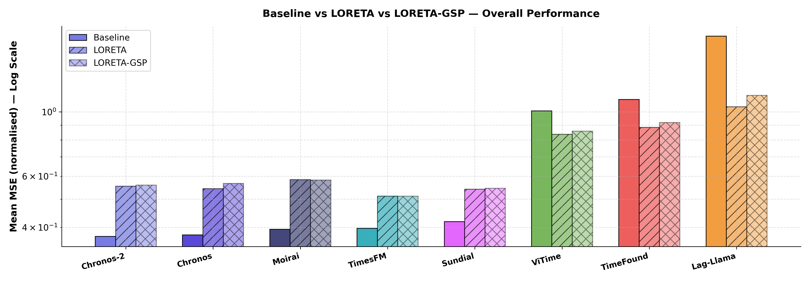
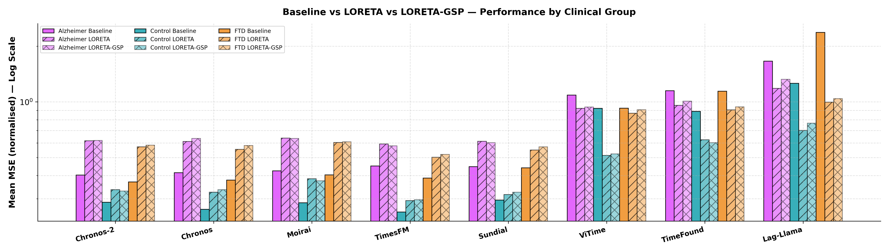

# TSFM Benchmark — Pipeline Comparison

## Parameters
- **Baseline**: scalp EEG (Fp1, Fp2, P3, P4)
- **LORETA**: sLORETA source parcels, 6 cortical regions × 2 hemispheres (fsaverage)
- **LORETA-GSP**: LORETA-GSP — sLORETA parcels projected onto network harmonics
- **Metric**: `mse_norm` (Mean MSE (normalised))

---

## Table 1 — Overall Comparison

| Model     |   Baseline Mean MSE (normalised) |   LORETA Mean MSE (normalised) |   LORETA-GSP Mean MSE (normalised) | Δ% LORETA vs Baseline   | Δ% LORETA-GSP vs Baseline   |
|:----------|---------------------------------:|-------------------------------:|-----------------------------------:|:------------------------|:----------------------------|
| Chronos   |                          0.37689 |                        0.54408 |                            0.56685 | +44.4%                  | +50.4%                      |
| Chronos-2 |                          0.37226 |                        0.5542  |                            0.55909 | +48.9%                  | +50.2%                      |
| Lag-Llama |                          1.8224  |                        1.0409  |                            1.1387  | -42.9%                  | -37.5%                      |
| Moirai    |                          0.39375 |                        0.58397 |                            0.58246 | +48.3%                  | +47.9%                      |
| Sundial   |                          0.41883 |                        0.54147 |                            0.54531 | +29.3%                  | +30.2%                      |
| TimeFound |                          1.1027  |                        0.88405 |                            0.91876 | -19.8%                  | -16.7%                      |
| TimesFM   |                          0.39704 |                        0.51267 |                            0.51222 | +29.1%                  | +29.0%                      |
| ViTime    |                          1.0078  |                        0.83646 |                            0.85779 | -17.0%                  | -14.9%                      |

> Positive Δ% = higher MSE (worse); negative = lower MSE (better).

---

## Table 2 — Performance by Clinical Group

