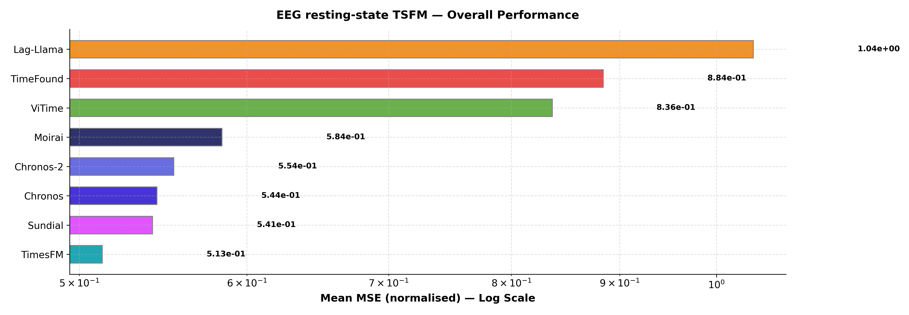
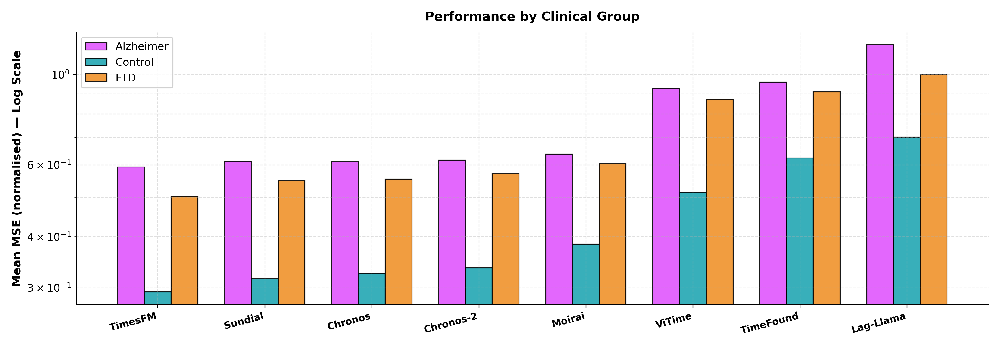
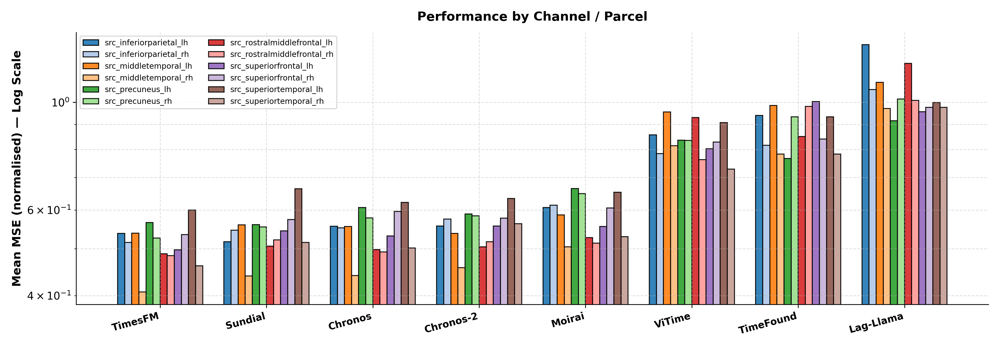

# TSFM Benchmark - Loreta Pipeline Results

## Parameters
- **Dataset**: ds004504 (Alzheimer resting-state EEG)
- **Pipeline**: sLORETA source parcels — 6 cortical regions x 2 hemispheres (fsaverage)
- **Context**: 512 samples  |  **Horizon**: 64 samples
- **Metric**: `mse_norm` (Mean MSE (normalised))

---

## Table 1 - Overall Performance

| Model     |   Mean MSE (normalised) |
|:----------|------------------------:|
| TimesFM   |                 0.51267 |
| Sundial   |                 0.54147 |
| Chronos   |                 0.54408 |
| Chronos-2 |                 0.5542  |
| Moirai    |                 0.58397 |
| ViTime    |                 0.83646 |
| TimeFound |                 0.88405 |
| Lag-Llama |                 1.0409  |

---

## Table 2 - Performance by Clinical Group

| Model     |   Alzheimer |   Control |     FTD |   Average |
|:----------|------------:|----------:|--------:|----------:|
| Chronos   |     0.61074 |   0.32541 | 0.55391 |   0.54408 |
| Chronos-2 |     0.61616 |   0.33546 | 0.5715  |   0.5542  |
| TimesFM   |     0.59268 |   0.29297 | 0.50197 |   0.51267 |
| Moirai    |     0.63789 |   0.3841  | 0.60402 |   0.58397 |
| Lag-Llama |     1.182   |   0.70121 | 0.99699 |   1.0409  |
| Sundial   |     0.61208 |   0.31567 | 0.54883 |   0.54147 |
| ViTime    |     0.92344 |   0.51351 | 0.86911 |   0.83646 |
| TimeFound |     0.95733 |   0.62394 | 0.90524 |   0.88405 |

---

## Table 3 - Performance by Source Parcel

| Model     |   src_inferiorparietal_lh |   src_inferiorparietal_rh |   src_middletemporal_lh |   src_middletemporal_rh |   src_precuneus_lh |   src_precuneus_rh |   src_rostralmiddlefrontal_lh |   src_rostralmiddlefrontal_rh |   src_superiorfrontal_lh |   src_superiorfrontal_rh |   src_superiortemporal_lh |   src_superiortemporal_rh |   Average |
|:----------|--------------------------:|--------------------------:|------------------------:|------------------------:|-------------------:|-------------------:|------------------------------:|------------------------------:|-------------------------:|-------------------------:|--------------------------:|--------------------------:|----------:|
| Chronos   |                   0.55593 |                   0.55173 |                 0.55544 |                 0.43995 |            0.6072  |            0.57805 |                       0.4976  |                       0.49242 |                  0.53103 |                  0.59591 |                   0.62249 |                   0.50123 |   0.54408 |
| Chronos-2 |                   0.55639 |                   0.57531 |                 0.53699 |                 0.45695 |            0.5892  |            0.58406 |                       0.50444 |                       0.51643 |                  0.55662 |                  0.57724 |                   0.63421 |                   0.56254 |   0.5542  |
| TimesFM   |                   0.53702 |                   0.51495 |                 0.53785 |                 0.40719 |            0.56591 |            0.52568 |                       0.48769 |                       0.48339 |                  0.49713 |                  0.53427 |                   0.59997 |                   0.46102 |   0.51267 |
| Moirai    |                   0.60726 |                   0.61373 |                 0.58676 |                 0.50396 |            0.66416 |            0.64873 |                       0.52664 |                       0.5129  |                  0.55536 |                  0.60598 |                   0.65315 |                   0.52895 |   0.58397 |
| Lag-Llama |                   1.3133  |                   1.0614  |                 1.0986  |                 0.97099 |            0.91557 |            1.0151  |                       1.2015  |                       1.0086  |                  0.95543 |                  0.97578 |                   0.99833 |                   0.97643 |   1.0409  |
| Sundial   |                   0.51648 |                   0.54576 |                 0.55967 |                 0.43934 |            0.55995 |            0.5542  |                       0.5057  |                       0.52095 |                  0.54387 |                  0.57357 |                   0.66369 |                   0.51452 |   0.54147 |
| ViTime    |                   0.85639 |                   0.784   |                 0.95439 |                 0.81337 |            0.83519 |            0.83471 |                       0.93054 |                       0.76175 |                  0.80251 |                  0.82772 |                   0.90838 |                   0.72861 |   0.83646 |
| TimeFound |                   0.93936 |                   0.81555 |                 0.98468 |                 0.78246 |            0.76575 |            0.93262 |                       0.85013 |                       0.98015 |                  1.003   |                  0.84021 |                   0.93265 |                   0.78207 |   0.88405 |

