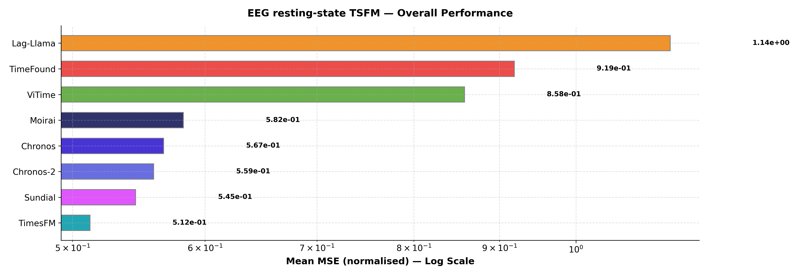
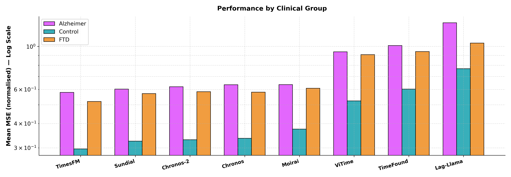
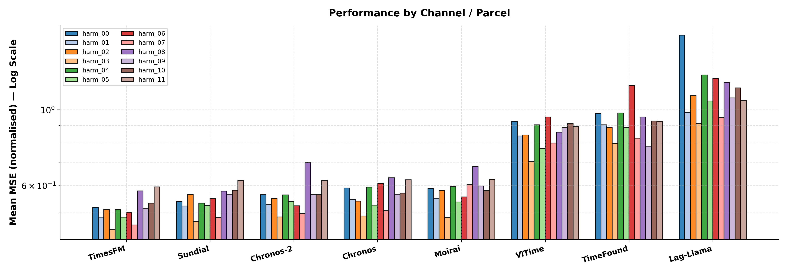

# TSFM Benchmark - Loreta_gsp Pipeline Results

## Parameters
- **Dataset**: ds004504 (Alzheimer resting-state EEG)
- **Pipeline**: LORETA-GSP — sLORETA parcels projected onto network harmonics (Euclidean connectome)
- **Context**: 512 samples  |  **Horizon**: 64 samples
- **Metric**: `mse_norm` (Mean MSE (normalised))

---

## Table 1 - Overall Performance

| Model     |   Mean MSE (normalised) |
|:----------|------------------------:|
| TimesFM   |                 0.51222 |
| Sundial   |                 0.54531 |
| Chronos-2 |                 0.55909 |
| Chronos   |                 0.56685 |
| Moirai    |                 0.58246 |
| ViTime    |                 0.85779 |
| TimeFound |                 0.91876 |
| Lag-Llama |                 1.1387  |

---

## Table 2 - Performance by Clinical Group

| Model     |   Alzheimer |   Control |     FTD |   Average |
|:----------|------------:|----------:|--------:|----------:|
| Chronos   |     0.63498 |   0.3357  | 0.58092 |   0.56685 |
| Chronos-2 |     0.61949 |   0.33018 | 0.58419 |   0.55909 |
| TimesFM   |     0.57927 |   0.29605 | 0.52013 |   0.51222 |
| Moirai    |     0.63513 |   0.37472 | 0.60863 |   0.58246 |
| Lag-Llama |     1.3245  |   0.76757 | 1.0407  |   1.1387  |
| Sundial   |     0.60224 |   0.32485 | 0.57146 |   0.54531 |
| ViTime    |     0.9379  |   0.52342 | 0.90729 |   0.85779 |
| TimeFound |     1.0102  |   0.60287 | 0.94062 |   0.91876 |

---

## Table 3 - Performance by Network Harmonic

| Model     |   harm_00 |   harm_01 |   harm_02 |   harm_03 |   harm_04 |   harm_05 |   harm_06 |   harm_07 |   harm_08 |   harm_09 |   harm_10 |   harm_11 |   Average |
|:----------|----------:|----------:|----------:|----------:|----------:|----------:|----------:|----------:|----------:|----------:|----------:|----------:|----------:|
| Chronos   |   0.59085 |   0.54792 |   0.5411  |   0.48907 |   0.59414 |   0.52682 |   0.6101  |   0.50776 |   0.63271 |   0.56676 |   0.5708  |   0.62416 |   0.56685 |
| Chronos-2 |   0.56552 |   0.52807 |   0.55079 |   0.48653 |   0.56417 |   0.54061 |   0.52427 |   0.49773 |   0.70103 |   0.56498 |   0.56446 |   0.62093 |   0.55909 |
| TimesFM   |   0.51881 |   0.48558 |   0.51156 |   0.44635 |   0.51167 |   0.48573 |   0.50178 |   0.46094 |   0.57952 |   0.51553 |   0.53392 |   0.59528 |   0.51222 |
| Moirai    |   0.58912 |   0.55173 |   0.58123 |   0.48367 |   0.59656 |   0.53748 |   0.55635 |   0.60371 |   0.68328 |   0.59903 |   0.58066 |   0.62672 |   0.58246 |
| Lag-Llama |   1.6521  |   0.98283 |   1.0989  |   0.91178 |   1.2632  |   1.0607  |   1.2367  |   0.94913 |   1.2037  |   1.083   |   1.1578  |   1.0647  |   1.1387  |
| Sundial   |   0.54019 |   0.52321 |   0.56602 |   0.47238 |   0.53405 |   0.52498 |   0.54962 |   0.48407 |   0.57851 |   0.56662 |   0.58237 |   0.62173 |   0.54531 |
| ViTime    |   0.92611 |   0.83892 |   0.84383 |   0.70567 |   0.90359 |   0.77159 |   0.95289 |   0.79957 |   0.86083 |   0.88658 |   0.91088 |   0.89302 |   0.85779 |
| TimeFound |   0.97582 |   0.90296 |   0.88892 |   0.79809 |   0.97846 |   0.88752 |   1.1777  |   0.82673 |   0.95274 |   0.78335 |   0.92668 |   0.92613 |   0.91876 |

