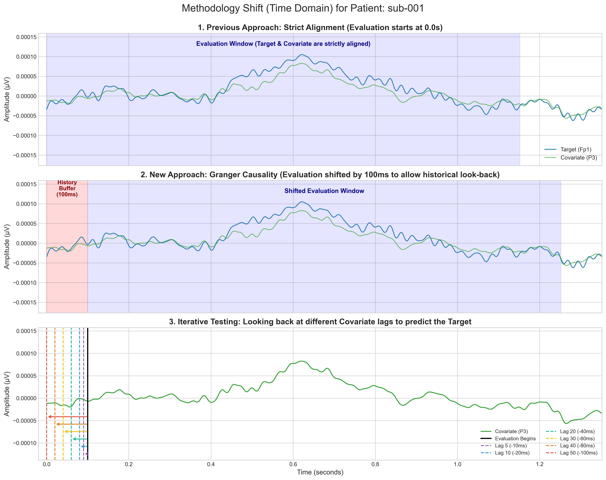

# Foundation Models Baseline

## Input:
* Preprocessed EEG signals from all 88 subjects, from 4 channels: Fp1, Fp2, P3, P4
* `FS` - 500 Hz (Original sampling frequency)
* `CONTEXT_LENGTH` - 512 (~1.02 s)
* `HORIZON_LENGTH` - 64 (~0.13 s)
* Window selection - 5 windows evenly spaced across the signal - np.linspace(0, max_start, 5) 

## Evaluation:
* MSE on 64 samples -> mean from 5 windows

#### Windows over signal:

#### Single window zoom:

## Adding covariates
Covariates have been added as the contex and horizon window corresponding to the timing of window for the predicted signal.
Following pairs were used for forecasting specific electrode signals.
* P3 + Fp1 -> P3
* P3 + Fp1 -> Fp1
* P4 + Fp2 -> P4
* P4 + Fp2 -> Fp2

#### Windows over target and covariate signals

## Used models, specifications:

| Model | Architecture / Size | Prediction Mode | Number of Samples (for Median) | Additional info |
| :--- | :--- | :--- | :--- | :--- |
| **Chronos** | T5-Base (NLP) | Probabilistic | 20 | - |
| **Chronos-2** | T5-Base (NLP) | Probabilistic | 20 | - |
| **TimesFM** | Patching (200M) | Point | N/A | - |
| **Moirai** | Universal Transformer (Base) | Probabilistic | 20 | Artificial sampling frequency forced to 1 second (`freq="S"`). |
| **Lag-Llama** | Llama-based | Probabilistic | 20 | Linear scaling of Rotary Position Embeddings applied (RoPE scaling factor: `(512+64)/32`) to handle the extended context window. |
| **TimeGPT** | Zero-Shot Cloud API | Point | N/A | Parameter `freq="S"`. Forced autoregressive mode (API warning) due to the horizon length (64). |
| **Sundial** | Causal LM (Base-128M) | Probabilistic | 20 | `transformers==4.40.1` required to turn on. |
| **ViTime** | Vision Transformer (ViT) | Probabilistic | 20 | Numerical conversion into 2D binary images. |
| **TimeFound** | Encoder-Decoder (Base-200M) | Point | N/A | Independent normalization (`StandardScaler`, z-score) for each window separately before input, and inverse transformation at the output. |

## Results:
### Table 1: Overall Performance (MSE)

| Model        |   Overall Mean MSE |
|:-------------|-------------------:|
| **Chronos2-cov** |        2.0687e-10  |
| **Timegpt-cov**  |        2.19094e-10 |
| Chronos2     |        4.26789e-10 |
| Timegpt      |        4.61399e-10 |
| Chronos      |        4.73524e-10 |
| Sundial      |        4.7541e-10  |
| Lag-Llama    |        1.14587e-09 |
| Moirai       |        2.31305e-08 |
| Vitime       |        5.22668e-08 |
| Timesfm      |        9.25312e-07 |
| **Timesfm-cov**  |        0.000136628 |

### Table 2: Performance by Patient Group (MSE)

| Model        |   A (Alzheimer) |   C (Control) |     F (FTD) |     Average |
|:-------------|----------------:|--------------:|------------:|------------:|
| **Chronos2-cov** |     2.29019e-10 |   1.87624e-10 | 1.9647e-10  | 2.04371e-10 |
| **Timegpt-cov**  |     2.50779e-10 |   1.93094e-10 | 2.02282e-10 | 2.15385e-10 |
| Chronos2     |     4.51583e-10 |   4.17975e-10 | 3.99094e-10 | 4.22884e-10 |
| Timegpt      |     4.70058e-10 |   4.64978e-10 | 4.43333e-10 | 4.59456e-10 |
| Chronos      |     5.19075e-10 |   4.35622e-10 | 4.50014e-10 | 4.68237e-10 |
| Sundial      |     5.10719e-10 |   4.52262e-10 | 4.49332e-10 | 4.70771e-10 |
| Lag-Llama    |     1.20215e-09 |   1.2058e-09  | 9.822e-10   | 1.13005e-09 |
| Moirai       |     3.7279e-08  |   1.3231e-08  | 1.3467e-08  | 2.13257e-08 |
| Vitime       |     5.25987e-08 |   5.1552e-08  | 5.26484e-08 | 5.22664e-08 |
| Timesfm      |     2.22153e-06 |   4.35667e-10 | 6.25908e-08 | 7.6152e-07  |
| **Timesfm-cov**  |     0.00033398  |   1.59236e-10 | 1.58556e-10 | 0.000111327 |

### Table 3: Performance by Electrode (MSE)

| Model        |         Fp1 |         Fp2 |          P3 |          P4 |     Average |
|:-------------|------------:|------------:|------------:|------------:|------------:|
| **Chronos2-cov** | 2.28759e-10 | 2.08259e-10 | 2.02269e-10 | 1.88195e-10 | 2.0687e-10  |
| **Timegpt-cov**  | 2.53653e-10 | 2.38283e-10 | 1.92106e-10 | 1.92332e-10 | 2.19094e-10 |
| Chronos2     | 4.61031e-10 | 4.43772e-10 | 4.07047e-10 | 3.95305e-10 | 4.26789e-10 |
| Timegpt      | 4.89381e-10 | 4.81693e-10 | 4.41102e-10 | 4.33419e-10 | 4.61399e-10 |
| Chronos      | 4.94979e-10 | 5.12373e-10 | 4.60068e-10 | 4.26675e-10 | 4.73524e-10 |
| Sundial      | 4.88827e-10 | 5.206e-10   | 4.47678e-10 | 4.44537e-10 | 4.7541e-10  |
| Lag-Llama    | 1.21672e-09 | 1.17526e-09 | 1.10785e-09 | 1.08364e-09 | 1.14587e-09 |
| Moirai       | 2.66403e-08 | 2.28446e-08 | 2.22077e-08 | 2.08295e-08 | 2.31305e-08 |
| Vitime       | 5.14331e-08 | 5.18469e-08 | 5.29789e-08 | 5.28081e-08 | 5.22668e-08 |
| Timesfm      | 9.10171e-07 | 9.08812e-07 | 9.08597e-07 | 9.73669e-07 | 9.25312e-07 |
| **Timesfm-cov**  | 1.96178e-10 | 0.000368619 | 0.000177895 | 1.5915e-10  | 0.000136628 |

# F-statistic and causality
## General description
The strength of the causal relationship was quantified using the F-statistic, which measures the proportional reduction in prediction error.

* The data was processed using `statsmodels.tsa.stattools.grangercausalitytests()`.
* The tests evaluated different lags values: `[10, 20, 40, 60, 80, 100]` ms..
* The significance threshold was set at alfa $\alpha = 0.05$.
* The *Percentage of Significant Windows* reflects the consistency of the causal relationship across the evaluated signal segments.
* The *Median* F-Statistic reflects the central magnitude of the causal effect.

## Input and windowing.
Tests were performed on the same five evaluation windows that the foundation models were tested on. To allow the covariate to utilize historical data relative to the forecasted signal, the start of the first evaluation window was shifted forward by max_lag (100 ms). The timing of the remaining windows was kept identical.

### Example of the first window shift.

## Results:
### Temporal Dynamics (Lag Profile)
The following plot illustrates how the consistency of the causal signal changes depending on the historical lag window.

### Causality Strength and consistency by Patient Group

### Significant Windows by Patient Group

### Table 4: Optimal Lag based on consistency of causality significance
| Pair      |   Optimal_Lag_ms |   Median_F |   Sig_Pct |
|:----------|-----------------:|-----------:|----------:|
| P4 -> Fp2 |               40 |       5.55 |     99.32 |
| P3 -> Fp1 |              100 |       3.69 |     99.09 |
| Fp1 -> P3 |               10 |       8.81 |     94.55 |
| Fp2 -> P4 |               10 |       9.01 |     94.32 |

### Table 5: Consistency of causality significance for different patient goups using optimal lag values from Table 4
| Pair      |      A |      C |     F |
|:----------|-------:|-------:|------:|
| Fp1 -> P3 |  96.67 |  94.48 | 91.3  |
| Fp2 -> P4 |  97.78 |  91.72 | 92.17 |
| P3 -> Fp1 | 100    |  98.62 | 98.26 |
| P4 -> Fp2 |  99.44 | 100    | 98.26 |

