# Foundation Models Baseline

## Input:
* Preprocessed EEG signals from all 88 subjects, from 4 channels: Fp1, Fp2, P3, P4
* `FS` - 500 Hz (Original sampling frequency)
* `CONTEXT_LENGTH` - 512 (~1.02 s)
* `HORIZON_LENGTH` - 64 (~0.13 s)
* Window selection - 5 windows evenly spaced across the signal, with initial 3 seconds excluded - np.linspace(3*FS, max_start, 5) 

## Example anomalies in initial seconds of recordings:
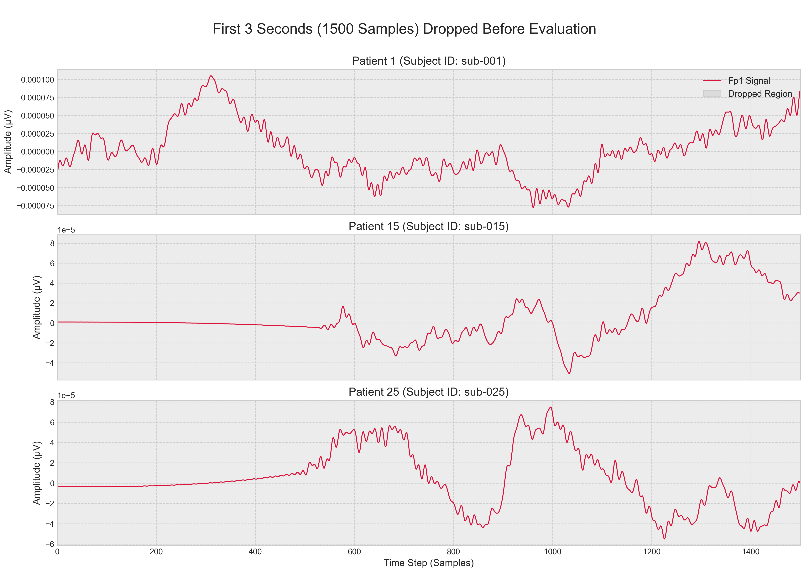

## Evaluation:
* MSE on 64 samples -> mean from 5 windows

#### Windows over signal:
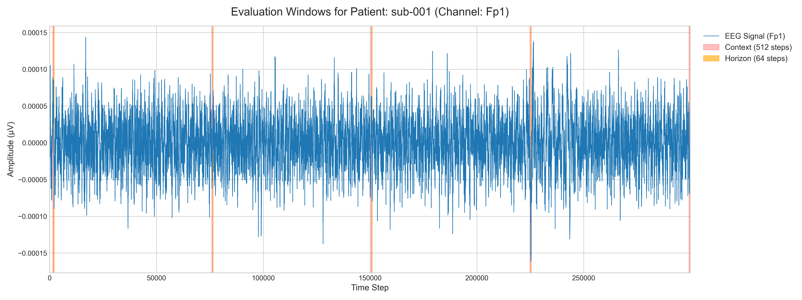

#### Single window zoom:

## Adding covariates
Covariates have been added as the contex and horizon window corresponding to the timing of window for the predicted signal.
Following pairs were used for forecasting specific electrode signals.
* P3 + Fp1 -> P3
* P3 + Fp1 -> Fp1
* P4 + Fp2 -> P4
* P4 + Fp2 -> Fp2

#### Windows over target and covariate signals
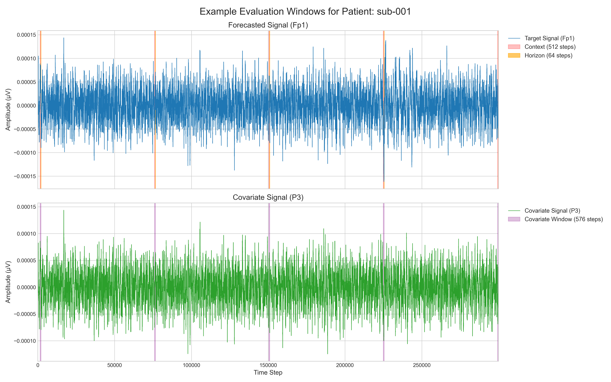

## Used models, specifications:

| Model | Architecture / Size | Prediction Mode | Number of Samples (for Median) | Additional info |
| :--- | :--- | :--- | :--- | :--- |
| **Chronos** | T5-Base (NLP) | Probabilistic | 20 | - |
| **Chronos-2** | T5-Base (NLP) | Probabilistic | 20 | - |
| **TimesFM** | Patching (200M) | Point | N/A | - |
| **Moirai** | Universal Transformer (Base) | Probabilistic | 20 | Artificial sampling frequency forced to 1 second (`freq="S"`). |
| **Lag-Llama** | Llama-based | Probabilistic | 20 | Linear scaling of Rotary Position Embeddings applied (RoPE scaling factor: `(512+64)/32`) to handle the extended context window. |
| **TimeGPT** | Zero-Shot Cloud API | Point | N/A | Parameter `freq="S"`. Forced autoregressive mode (API warning) due to the horizon length (64). |
| **Sundial** | Causal LM (Base-128M) | Probabilistic | 20 | `transformers==4.40.1` required to turn on. |
| **ViTime** | Vision Transformer (ViT) | Probabilistic | 20 | Numerical conversion into 2D binary images. |
| **TimeFound** | Encoder-Decoder (Base-200M) | Point | N/A | Independent normalization (`StandardScaler`, z-score) for each window separately before input, and inverse transformation at the output. |

## Results:
### Table 1: Overall Performance (MSE)

| Model        |   Overall Mean MSE |
|:-------------|-------------------:|
| Timesfm_cov  |        1.97541e-10 |
| Chronos2_cov |        2.19973e-10 |
| Chronos2     |        4.73529e-10 |
| Chronos      |        5.16301e-10 |
| Sundial      |        1.05395e-09 |
| Vitime       |        1.05395e-09 |
| Lag-Llama    |        5.30604e-09 |
| Moirai       |        1.50025e-08 |
| Timesfm      |        1.6746e-08  |

### Table 2: Performance by Patient Group (MSE)

| Model        |   A (Alzheimer) |   C (Control) |     F (FTD) |     Average |
|:-------------|----------------:|--------------:|------------:|------------:|
| Timesfm_cov  |     2.14347e-10 |   1.7374e-10  | 2.01246e-10 | 1.96444e-10 |
| Chronos2_cov |     2.26811e-10 |   2.02074e-10 | 2.31838e-10 | 2.20241e-10 |
| Chronos2     |     4.73699e-10 |   4.52225e-10 | 5.00123e-10 | 4.75349e-10 |
| Chronos      |     5.22585e-10 |   4.7408e-10  | 5.59699e-10 | 5.18788e-10 |
| Sundial      |     1.14462e-09 |   9.98709e-10 | 9.81698e-10 | 1.04167e-09 |
| Vitime       |     1.14462e-09 |   9.98709e-10 | 9.81698e-10 | 1.04167e-09 |
| Lag-Llama    |     5.36977e-09 |   5.44587e-09 | 5.02996e-09 | 5.28187e-09 |
| Moirai       |     1.8865e-08  |   7.62569e-09 | 1.82581e-08 | 1.49163e-08 |
| Timesfm      |     5.39555e-10 |   4.53336e-10 | 6.26554e-08 | 2.12161e-08 |

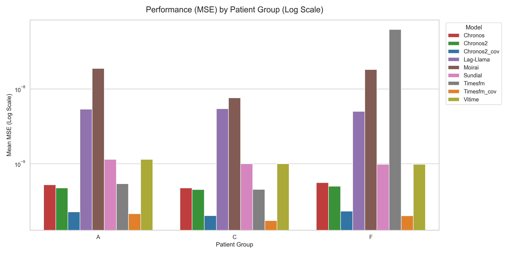

### Table 3: Performance by Electrode (MSE)

| Model        |         Fp1 |         Fp2 |          P3 |          P4 |     Average |
|:-------------|------------:|------------:|------------:|------------:|------------:|
| Timesfm_cov  | 2.02277e-10 | 2.06185e-10 | 2.00823e-10 | 1.80879e-10 | 1.97541e-10 |
| Chronos2_cov | 2.24054e-10 | 2.26409e-10 | 2.21468e-10 | 2.0796e-10  | 2.19973e-10 |
| Chronos2     | 4.89602e-10 | 4.87868e-10 | 4.64271e-10 | 4.52374e-10 | 4.73529e-10 |
| Chronos      | 5.44368e-10 | 5.5126e-10  | 4.8019e-10  | 4.89385e-10 | 5.16301e-10 |
| Sundial      | 1.11935e-09 | 1.20673e-09 | 9.55709e-10 | 9.3402e-10  | 1.05395e-09 |
| Vitime       | 1.11935e-09 | 1.20673e-09 | 9.55709e-10 | 9.3402e-10  | 1.05395e-09 |
| Lag-Llama    | 5.3539e-09  | 5.44696e-09 | 5.27308e-09 | 5.15021e-09 | 5.30604e-09 |
| Moirai       | 1.43614e-08 | 1.21267e-08 | 1.77347e-08 | 1.57873e-08 | 1.50025e-08 |
| Timesfm      | 5.01458e-10 | 5.16905e-10 | 5.11325e-10 | 6.54542e-08 | 1.6746e-08  |

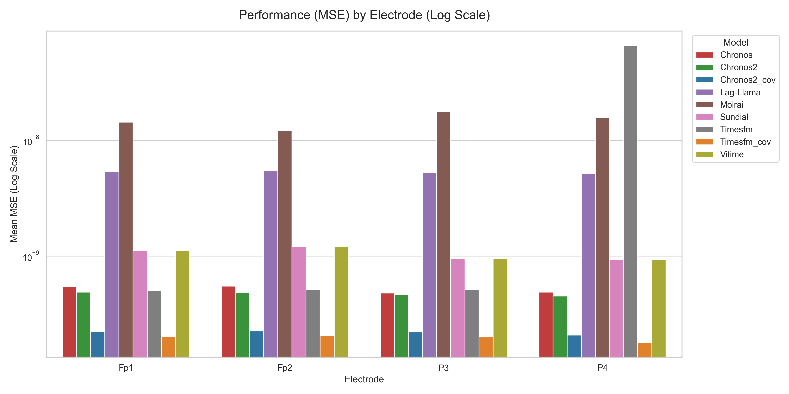

# F-statistic and causality
The strength of the causal relationship was quantified using the F-statistic, which measures the proportional reduction in prediction error.

* The data was processed using manualy implemented test with `LinearRegression` from `scikit-learn`.
* The tests evaluated different lags values: `[10, 20, 40, 60, 80, 100]` ms..
* The significance threshold was set at alfa $\alpha = 0.05$.
* The *Percentage of Significant Windows* reflects the consistency of the causal relationship across the evaluated signal segments.
* The *Median* F-Statistic reflects the central magnitude of the causal effect.

Granger Causality (as a baseline) was quantified using a manual implementation of the F-test based on ordinary least squares (OLS) linear regression. This method tests whether past values of a covariate signal provide statistically significant information about the future values of a target signal,

Foundation models were used as univariate forecasters (predicting the target signal without covariate information). Subsequently, the prediction residuals (errors) were analyzed using multiple linear regression to determine if lagged covariate signals could explain the variance in the model's errors.

## Granger causality and foundation models causality tests results:
### Temporal Dynamics (Lag Profile)
The following plot illustrates how the consistency of the causal signal changes depending on the historical lag window.
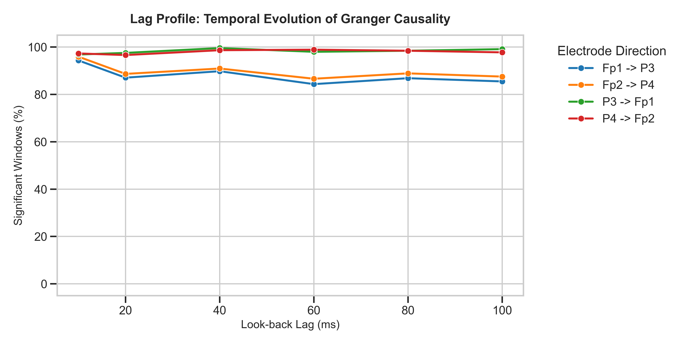
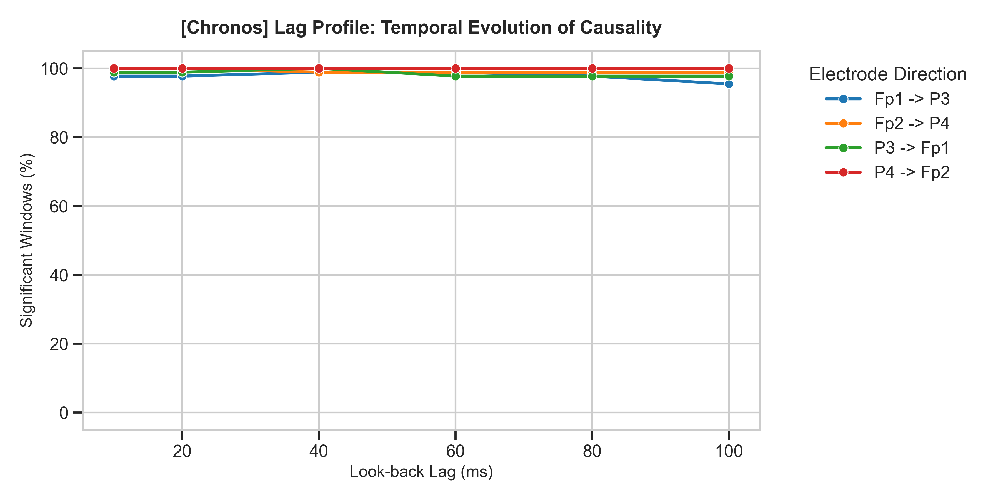
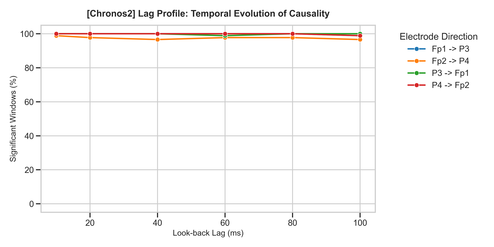
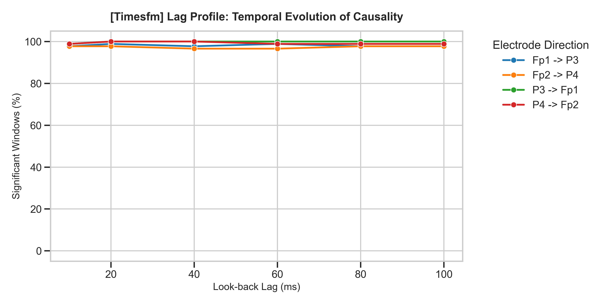

### Causality Strength and consistency by Patient Group
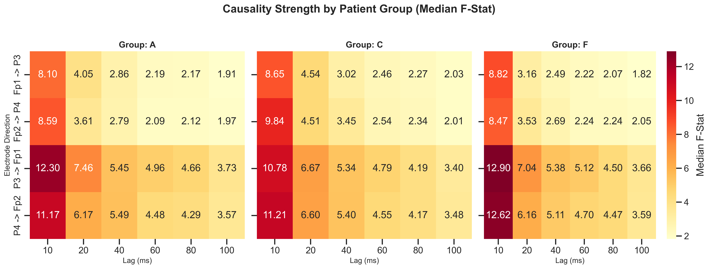
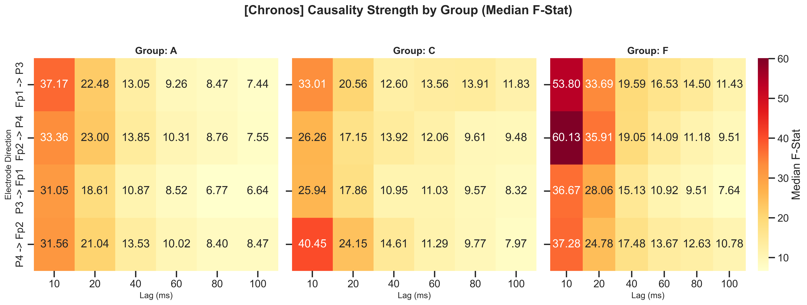
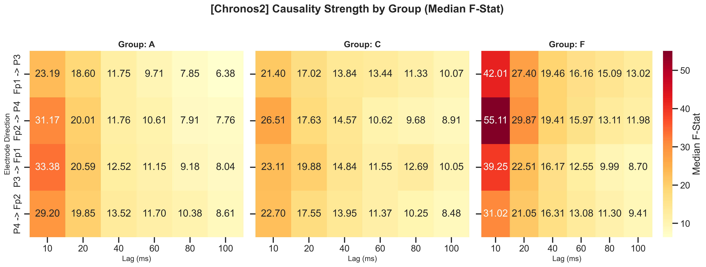
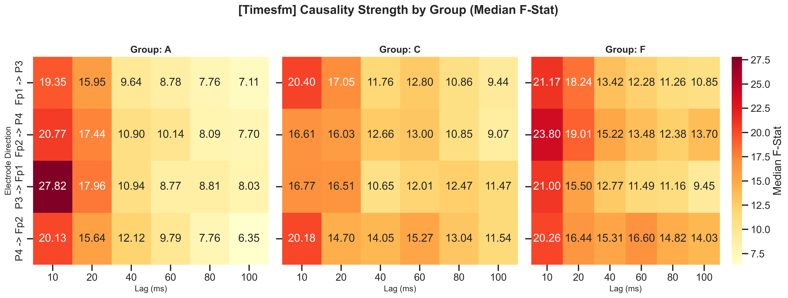

### Significant Windows by Patient Group
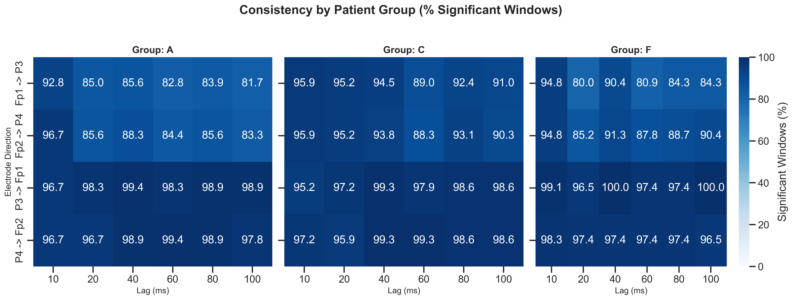
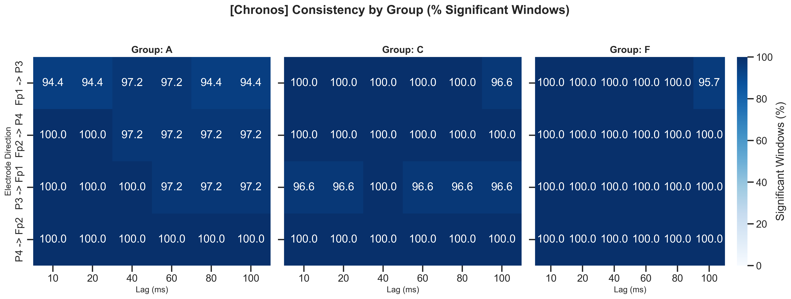
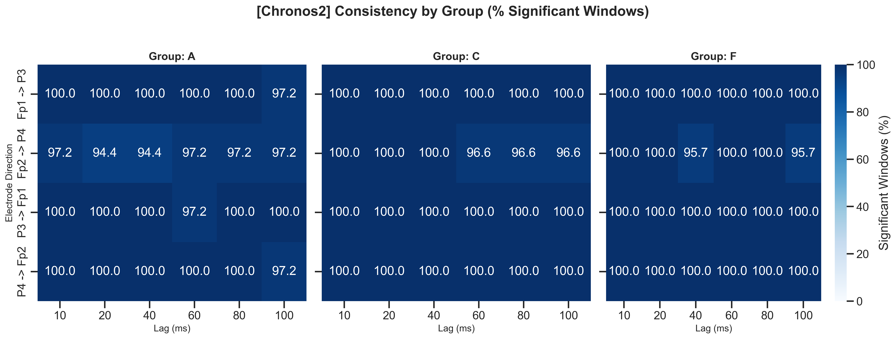
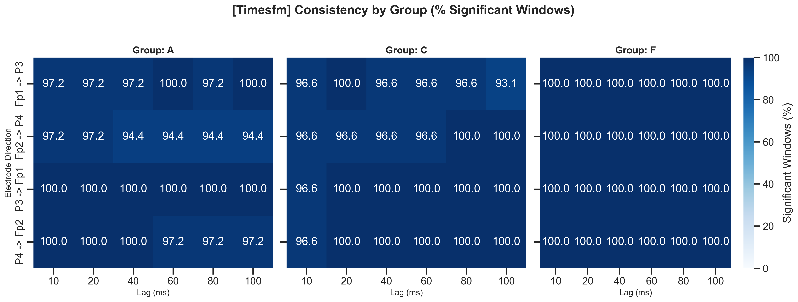

## Optimal Lag based on consistency of causality significance

### Table 4. Granger
| Pair      |   Optimal_Lag_ms |   Median_F |   Sig_Pct |
|:----------|-----------------:|-----------:|----------:|
| P4 -> Fp2 |               40 |       5.55 |     99.32 |
| P3 -> Fp1 |              100 |       3.69 |     99.09 |
| Fp1 -> P3 |               10 |       8.81 |     94.55 |
| Fp2 -> P4 |               10 |       9.01 |     94.32 |

### Table 4. Chronos
| Pair      |   Optimal_Lag_ms |   Median_F |   Sig_Pct |
|:----------|-----------------:|-----------:|----------:|
| Fp2 -> P4 |               10 |      39.18 |    100    |
| P3 -> Fp1 |               40 |      12.33 |    100    |
| P4 -> Fp2 |               10 |      33.58 |    100    |
| Fp1 -> P3 |               40 |      14    |     98.86 |

### Table 5. Chronos2
| Pair      |   Optimal_Lag_ms |   Median_F |   Sig_Pct |
|:----------|-----------------:|-----------:|----------:|
| Fp1 -> P3 |               10 |      27.43 |    100    |
| P3 -> Fp1 |               10 |      31.6  |    100    |
| P4 -> Fp2 |               10 |      25.59 |    100    |
| Fp2 -> P4 |               10 |      31.17 |     98.86 |

### Table 6. TimesFM
| Pair      |   Optimal_Lag_ms |   Median_F |   Sig_Pct |
|:----------|-----------------:|-----------:|----------:|
| P4 -> Fp2 |               20 |      15.3  |    100    |
| P3 -> Fp1 |               20 |      17.07 |    100    |
| Fp1 -> P3 |               20 |      16.88 |     98.86 |
| Fp2 -> P4 |               10 |      19.36 |     97.73 |

## Consistency of causality significance for different patient goups using optimal lag values from Table 4

### Table 7. Granger
| Pair      |      A |      C |     F |
|:----------|-------:|-------:|------:|
| Fp1 -> P3 |  96.67 |  94.48 | 91.3  |
| Fp2 -> P4 |  97.78 |  91.72 | 92.17 |
| P3 -> Fp1 | 100    |  98.62 | 98.26 |
| P4 -> Fp2 |  99.44 | 100    | 98.26 |

### Table 8. Chronos
| Pair      |      A |   C |   F |
|:----------|-------:|----:|----:|
| Fp1 -> P3 |  97.22 | 100 | 100 |
| Fp2 -> P4 | 100    | 100 | 100 |
| P3 -> Fp1 | 100    | 100 | 100 |
| P4 -> Fp2 | 100    | 100 | 100 |

### Table 9. Chronos2
| Pair      |      A |   C |   F |
|:----------|-------:|----:|----:|
| Fp1 -> P3 | 100    | 100 | 100 |
| Fp2 -> P4 |  97.22 | 100 | 100 |
| P3 -> Fp1 | 100    | 100 | 100 |
| P4 -> Fp2 | 100    | 100 | 100 |

### Table 10. TimesFM
| Pair      |      A |      C |   F |
|:----------|-------:|-------:|----:|
| Fp1 -> P3 |  97.22 | 100    | 100 |
| Fp2 -> P4 |  97.22 |  96.55 | 100 |
| P3 -> Fp1 | 100    | 100    | 100 |
| P4 -> Fp2 | 100    | 100    | 100 |

