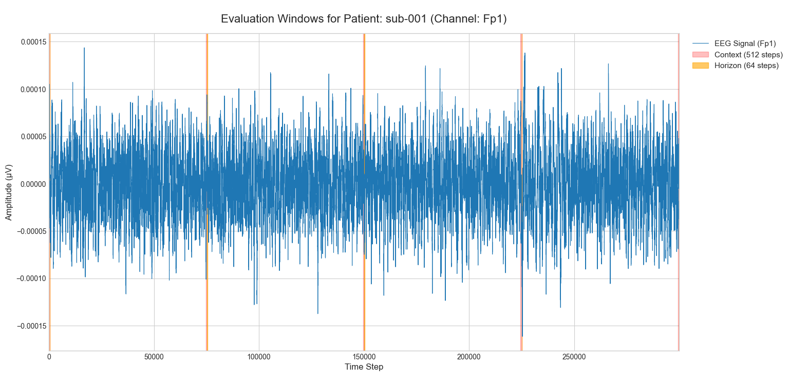
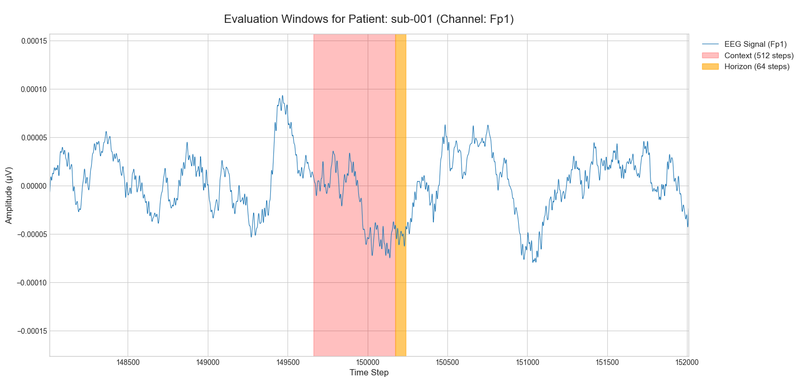
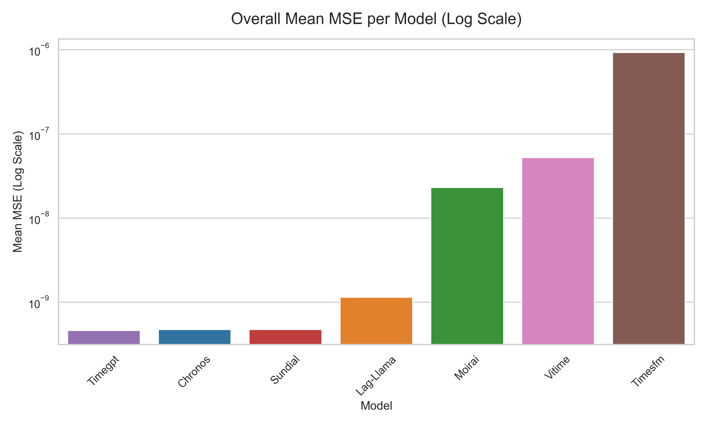
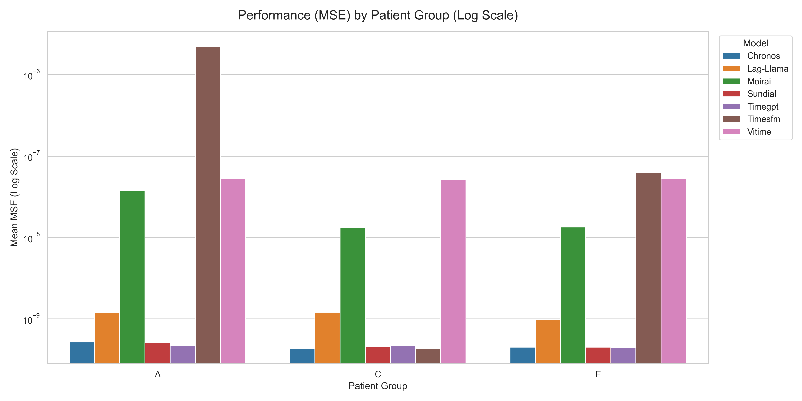
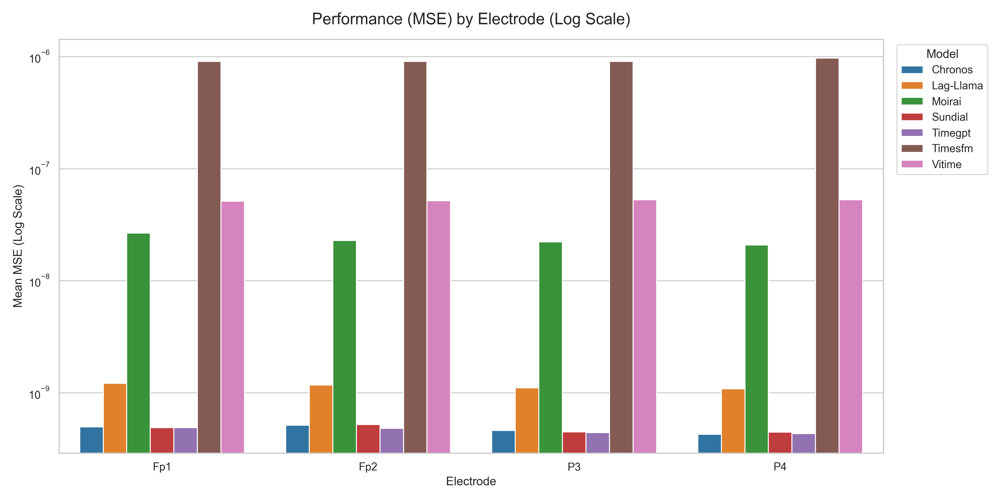

# Foundation Models Baseline

## Input:
* Preprocessed EEG signals from all 88 subjects, from 4 channels: Fp1, Fp2, P3, P4
* `FS` - 500 Hz (Original sampling frequency)
* `CONTEXT_LENGTH` - 512 (~1.02 s)
* `HORIZON_LENGTH` - 64 (~0.13 s)
* Window selection - 5 windows evenly spaced across the signal - np.linspace(0, max_start, 5) 

## Evaluation:
* MSE on 64 samples -> mean from 5 windows

### Windows over signal:

### Single window zoom:

## Used models, specification:
| Model | Architecture / Size | Prediction Mode | Number of Samples (for Median) | Additional info |
| :--- | :--- | :--- | :--- | :--- |
| **Chronos** | T5-Base (NLP) | Probabilistic | 20 | - |
| **TimesFM** | Patching (200M) | Point | N/A | - |
| **Moirai** | Universal Transformer (Base) | Probabilistic | 20 | Artificial sampling frequency forced to 1 second (`freq="S"`). |
| **Lag-Llama** | Llama-based | Probabilistic | 20 | Linear scaling of Rotary Position Embeddings applied (RoPE scaling factor: `(512+64)/32`) to handle the extended context window. |
| **TimeGPT** | Zero-Shot Cloud API | Point | N/A | Parameter `freq="S"`. Forced autoregressive mode (API warning) due to the horizon length (64). |
| **Sundial** | Causal LM (Base-128M) | Probabilistic | 20 | `transformers==4.40.1` required to turn on. |
| **ViTime** | Vision Transformer (ViT) | Probabilistic | 20 | Numerical conversion into 2D binary images. |
| **TimeFound** | Encoder-Decoder (Base-200M) | Point | N/A | Independent normalization (`StandardScaler`, z-score) for each window separately before input, and inverse transformation at the output. |

## Results:
### Table 1: Overall Performance (MSE)

| Model     |   Overall Mean MSE |
|:----------|-------------------:|
| Timegpt   |        4.61399e-10 |
| Chronos   |        4.73524e-10 |
| Sundial   |        4.7541e-10  |
| Lag-Llama |        1.14587e-09 |
| Moirai    |        2.31305e-08 |
| Vitime    |        5.22668e-08 |
| Timesfm   |        9.25312e-07 |

### Table 2: Performance by Patient Group (MSE)

| Model     |      A (Alzheimer) |      C (Control) |      F (FTD) |     Average |
|:----------|------------:|------------:|------------:|------------:|
| Timegpt   | 4.70058e-10 | 4.64978e-10 | 4.43333e-10 | 4.59456e-10 |
| Chronos   | 5.19075e-10 | 4.35622e-10 | 4.50014e-10 | 4.68237e-10 |
| Sundial   | 5.10719e-10 | 4.52262e-10 | 4.49332e-10 | 4.70771e-10 |
| Lag-Llama | 1.20215e-09 | 1.2058e-09  | 9.822e-10   | 1.13005e-09 |
| Moirai    | 3.7279e-08  | 1.3231e-08  | 1.3467e-08  | 2.13257e-08 |
| Vitime    | 5.25987e-08 | 5.1552e-08  | 5.26484e-08 | 5.22664e-08 |
| Timesfm   | 2.22153e-06 | 4.35667e-10 | 6.25908e-08 | 7.6152e-07  |

### Table 3: Performance by Electrode (MSE)

| Model     |         Fp1 |         Fp2 |          P3 |          P4 |     Average |
|:----------|------------:|------------:|------------:|------------:|------------:|
| Timegpt   | 4.89381e-10 | 4.81693e-10 | 4.41102e-10 | 4.33419e-10 | 4.61399e-10 |
| Chronos   | 4.94979e-10 | 5.12373e-10 | 4.60068e-10 | 4.26675e-10 | 4.73524e-10 |
| Sundial   | 4.88827e-10 | 5.206e-10   | 4.47678e-10 | 4.44537e-10 | 4.7541e-10  |
| Lag-Llama | 1.21672e-09 | 1.17526e-09 | 1.10785e-09 | 1.08364e-09 | 1.14587e-09 |
| Moirai    | 2.66403e-08 | 2.28446e-08 | 2.22077e-08 | 2.08295e-08 | 2.31305e-08 |
| Vitime    | 5.14331e-08 | 5.18469e-08 | 5.29789e-08 | 5.28081e-08 | 5.22668e-08 |
| Timesfm   | 9.10171e-07 | 9.08812e-07 | 9.08597e-07 | 9.73669e-07 | 9.25312e-07 |

